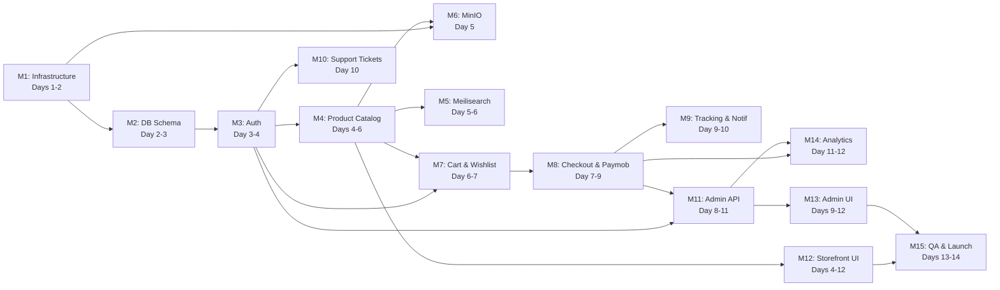

# PrintByFalcon — System Analysis

> Deep-dive synthesis from **PRD v1.0** and **14-Day Implementation Plan**

---

## 1. System Architecture Summary

PrintByFalcon is a **bilingual (AR/EN) B2C/B2B e-commerce platform** for printers and printing supplies targeting the Egyptian/Arab market.

### Architecture Style
**Containerized monolith-ish** — not true microservices, but a well-decomposed monorepo with distinct backend modules running as a single NestJS process, a separate Next.js frontend, and supporting infrastructure services. All orchestrated via Docker Compose on a single VPS.

### Topology

```
┌──────────────────────── Hostinger KVM 2 VPS (2 vCPU, 8 GB RAM, 100 GB NVMe) ────────────────────────┐
│                                                                                                       │
│   ┌─────────────┐     ┌──────────────────┐    ┌──────────────────┐                                    │
│   │   Nginx     │────▶│  Next.js (SSR)   │    │   NestJS API     │                                    │
│   │  :80/:443   │────▶│     :3000        │    │     :4000        │                                    │
│   │  SSL/gzip   │     │  [Storefront +   │───▶│  [REST API +     │                                    │
│   └─────────────┘     │   Admin UI]      │    │   Business Logic]│                                    │
│                       └──────────────────┘    └───────┬──────────┘                                    │
│                                                       │                                               │
│                    ┌──────────────┬───────────────┬────┴──────────┐                                    │
│                    ▼              ▼               ▼               ▼                                    │
│             ┌────────────┐ ┌──────────┐   ┌────────────┐  ┌───────────┐                               │
│             │ PostgreSQL │ │  Redis   │   │ Meilisearch│  │   MinIO   │                               │
│             │  16 :5432  │ │  7 :6379 │   │   :7700    │  │:9000/9001 │                               │
│             │ [Primary   │ │ [Cache,  │   │ [Full-text │  │ [Product  │                               │
│             │  Data]     │ │ Sessions,│   │  Search]   │  │  Images]  │                               │
│             │  2 GB mem  │ │ Cart,    │   │  1 GB mem  │  │           │                               │
│             └────────────┘ │ Queues]  │   └────────────┘  └───────────┘                               │
│                            │ 512 MB   │                                                               │
│                            └──────────┘                                                               │
│                                                                                                       │
│   External: Paymob (payments), Vonage/Twilio (SMS), SendGrid/SMTP (email), Sentry (errors)           │
└───────────────────────────────────────────────────────────────────────────────────────────────────────┘
```

### Key Architectural Traits
| Trait | Decision |
|---|---|
| Rendering | SSR/SSG hybrid via Next.js App Router (SEO-critical pages SSR'd) |
| API Style | REST under `/api/v1`, JSON payloads, Bearer JWT auth |
| State Management | Zustand (client state) + React Query (server state) — clean separation |
| Database Access | Prisma ORM — type-safe, migrations-first |
| Search | Meilisearch (not Elasticsearch) — lightweight, typo-tolerant, Arabic support |
| File Storage | Self-hosted MinIO (S3-compatible) — no cloud dependency |
| Async Processing | Bull queues backed by Redis (email, SMS, notifications) |
| i18n | Egyptian Arabic primary (RTL) / English secondary (LTR) — `next-i18next` |

---

## 2. Module Breakdown

### 2.1 Infrastructure Layer (No business logic)

| Module | ID | Responsibility | Key Deliverables |
|---|---|---|---|
| **Infrastructure & DevOps** | M1 | VPS hardening, Docker Compose, Nginx reverse proxy, SSL via Certbot, CI/CD via GitHub Actions | Hardened VPS, 7-container Docker stack, HTTPS, deploy pipeline |
| **Database & Schema** | M2 | Prisma schema design, migrations, seed data | 20+ models, critical indexes, seed script |

### 2.2 Auth & Identity

| Module | ID | Responsibility | Key Deliverables |
|---|---|---|---|
| **Auth Module** | M3 | Registration, login, JWT access/refresh token lifecycle, password reset, RBAC guards, role decorators | `JwtAuthGuard`, `RolesGuard`, `@Roles()`, refresh token rotation, bcrypt hashing |

**Roles:** `SUPERADMIN`, `SALES_MANAGER`, `CUSTOMER_SERVICE`, `CUSTOMER`, `SUPPLIER` (implicit), `GUEST` (unauthenticated)

### 2.3 Catalog & Discovery

| Module | ID | Responsibility | Key Deliverables |
|---|---|---|---|
| **Product Catalog API** | M4 | Products, Categories, Brands full CRUD; bilingual fields; filtering; pagination; printer compatibility matrix | Public + Admin product endpoints, DTOs with validation |
| **Meilisearch Integration** | M5 | Product indexing, smart search, autocomplete, typo tolerance, Arabic synonyms | IndexProduct on CRUD events, bulk sync script, search analytics logging |
| **File Storage (MinIO)** | M6 | Product image upload, presigned URLs, public URL generation | Upload service, Multer config (5 files, 5 MB, image types only) |

### 2.4 Commerce Core

| Module | ID | Responsibility | Key Deliverables |
|---|---|---|---|
| **Cart & Wishlist** | M7 | Guest cart (Redis), user cart (DB), cart merge on login, stock validation, coupon application, wishlist CRUD, save-for-later | Dual storage strategy, additive merge, real-time price enrichment |
| **Checkout & Paymob** | M8 | Order creation, totals calculation (subtotal + shipping + VAT − coupon), Paymob 3-step payment flow (Card, Fawry, COD), webhook HMAC validation, stock rollback on failure | Order state machine, HMAC verification, invoice number generation |

### 2.5 Fulfillment & Communication

| Module | ID | Responsibility | Key Deliverables |
|---|---|---|---|
| **Order Tracking & Notifications** | M9 | Order status timeline, courier tracking URL mapping, email templates (Handlebars), SMS via Vonage, Bull queue async dispatch | 6 email templates, order events service, retry with backoff |
| **Support Tickets** | M10 | Ticket CRUD, priority/category, agent assignment, internal notes, satisfaction rating | Customer + admin ticket endpoints |

### 2.6 Admin & Analytics

| Module | ID | Responsibility | Key Deliverables |
|---|---|---|---|
| **Admin Panel API** | M11 | All admin CRUD (Products, Orders, Users, Staff), IP whitelist guard, bulk CSV import, product duplication, audit logging | AdminGuard (IP whitelist), AuditLogService, refund API |
| **Analytics & Reports** | M14 | Sales/revenue summaries, top products, search term analytics, abandoned cart rate, Excel export | Raw SQL for performance, ExcelJS workbooks |

### 2.7 Frontend

| Module | ID | Responsibility | Key Deliverables |
|---|---|---|---|
| **Frontend — Storefront** | M12 | All customer-facing pages: Home, Product List/Detail, Search, Cart, Checkout, My Orders, Profile, Wishlist, Support | SSR/SSG, i18n, RTL, Zustand stores, React Query hooks, Schema.org JSON-LD |
| **Frontend — Admin UI** | M13 | Admin dashboard, data tables, KPI cards, revenue charts, order/product management UI | Recharts, DataTable components, admin JWT routing |

### 2.8 Launch

| Module | ID | Responsibility | Key Deliverables |
|---|---|---|---|
| **QA, Hardening & Launch** | M15 | Playwright E2E, Jest unit tests, Helmet+CSP, CORS lock, rate limiting hardening, OWASP scan, Sentry, Uptime Kuma, backups, go-live | Passing test suites, security headers, monitoring, backup cron, runbook |

---

## 3. Execution Order (Dependency-Driven)

The critical path and dependency graph dictates a strict build order:



### Phase-by-Phase Execution

| Phase | Days | Modules | Gate |
|---|---|---|---|
| **Phase 1: Foundation** | 1–2 | M1 (Infra), M2 (Schema) | VPS + Docker running, schema migrated |
| **Phase 2: Auth + Catalog** | 3–6 | M3 (Auth), M4 (Products), M5 (Search), M6 (Upload) | Auth working, product CRUD + search live |
| **Phase 3: Commerce** | 6–9 | M7 (Cart), M8 (Checkout/Paymob) | End-to-end purchase flow operational |
| **Phase 4: Fulfillment** | 8–10 | M9 (Tracking), M10 (Support), M11 (Admin API) | Order lifecycle complete, admin CRUD working |
| **Phase 5: Frontend + Analytics** | 4–12 | M12 (Storefront), M13 (Admin UI), M14 (Analytics) | Full UI navigable, analytics returning data |
| **Phase 6: Launch** | 13–14 | M15 (QA + Deploy) | All critical checklist items passed |

> [!IMPORTANT]
> **M12 (Storefront)** runs in parallel from Day 4 onwards. This means frontend work begins as soon as the first API endpoints (products) exist, and new pages are added incrementally as backend modules come online. This parallelism is essential for the 14-day timeline.

---

## 4. Key Technical Decisions

### 4.1 Decisions I Agree With ✅

| Decision | Rationale |
|---|---|
| **Prisma ORM** | Type-safe queries, automatic migration tracking, excellent for a schema-heavy e-commerce app |
| **Meilisearch over Elasticsearch** | Much lighter (1 GB RAM vs. 4+ GB), native typo tolerance, simpler setup — ideal for single-VPS constraints |
| **MinIO self-hosted** | Avoids cloud storage costs, S3-compatible so easy to migrate later |
| **Bull queues for notifications** | Correct — email/SMS must never block the checkout response |
| **Dual cart strategy (Redis + DB)** | Properly handles both guest and authenticated experiences |
| **JWT refresh token rotation** | Security best practice — limits token reuse window |
| **Turborepo monorepo** | Shared types between frontend/backend eliminate DTO drift |
| **Docker memory limits** | Mandatory on 8 GB VPS — prevents a single service from OOM-killing others |
| **SSR for product/category pages** | Non-negotiable for SEO in e-commerce |

### 4.2 Decisions That Need Scrutiny ⚠️

| Decision | Concern |
|---|---|
| **No PgBouncer** | PRD mentions PgBouncer for connection pooling, but the Implementation Plan omits it. With Prisma's connection pool + Docker + postgres:16-alpine, this might be fine for v1.0 but will bite at scale. |
| **Cursor-based pagination** | Good for infinite scroll, but the admin data tables will need offset-based pagination too. Plan only mentions cursor-based. |
| **next-i18next** | With Next.js 14 App Router, the standard approach is `next-intl` or manual route-based i18n (`[locale]/...`). `next-i18next` is Pages Router era. The plan does mention `[locale]` route groups, so there's a conflict in tooling. |
| **Express-session for guest carts** | NestJS is Fastify-compatible but the plan installs `express-session` + `connect-redis`, coupling to Express. Fine if confirmed Express adapter. |
| **Live chat** | PRD specifies a live chat widget, but the Implementation Plan has no mention of building or integrating one (e.g., Tawk.to, Intercom). Only support tickets are implemented. |
| **Supplier role endpoints** | PRD defines a Supplier role that can "view purchase orders, update delivery status, manage catalog entries." The plan builds SupplierService as admin-only — no supplier-facing portal or auth path. |

---

## 5. Risks & Missing Pieces

### 5.1 High-Risk Items 🔴

| Risk | Impact | Detail |
|---|---|---|
| **14-day timeline is extremely aggressive** | Schedule overrun | The PRD itself suggests **16 weeks**. The Implementation Plan compresses this into **14 days** at 8–10 hours/day. This is feasible only with a highly experienced solo dev and zero scope creep. Any Paymob integration issue, Arabic rendering bug, or VPS config problem will cascate. |
| **Paymob sandbox delays** | Blocks checkout | Paymob approval and sandbox access can take days. If not pre-arranged, Days 7–9 are blocked. The plan acknowledges this risk but the mitigation (mock webhooks) only partially covers it. |
| **VPS RAM ceiling** | OOM crashes | 8 GB total with allocations: Postgres 2GB + Meilisearch 1GB + Next.js 1GB + NestJS 512MB + Redis 512MB + MinIO (unlimited?) + Nginx ≈ 5.5 GB allocated. OS + Docker overhead = ~1.5 GB. That leaves **~1 GB margin**. Under load, this is thin. |
| **No staging environment** | Risk of production bugs | The plan deploys directly to a single VPS. No separate staging. Playwright tests target `https://printbyfalcon.com` staging — but that IS production. |

### 5.2 Missing or Underspecified Pieces 🟡

| Missing Piece | PRD Expectation | Plan Coverage |
|---|---|---|
| **Live chat widget** | PRD §5.7 — "Live chat widget integrated into all pages" | ❌ Not in the 14-day plan at all |
| **WhatsApp integration** | PRD §5.7 — "WhatsApp integration button" | ❌ Not mentioned |
| **Mobile wallet payments** | PRD §5.5.2 — Vodafone Cash, Orange Cash planned for v1.1 | ⚪ Correctly deferred |
| **Google social login** | PRD §5.1.1 — "Social login via Google (optional v1.1)" | ⚪ Correctly deferred |
| **Bulk order status update** | PRD §6.5 — "Bulk status update for multiple orders" | ❌ Only single-order PATCH in plan |
| **Print invoice/packing slip** | PRD §6.5 — "Print invoice / packing slip" | ❌ Not in the plan |
| **Scheduled automated reports** | PRD §6.8.4 — "Schedule automated reports emailed to admins" | ❌ Only manual export implemented |
| **Product variants** | PRD §6.3.3 — "Manage product variants" | ⚠️ ProductVariant model exists in schema but no variant-specific CRUD in plan tasks |
| **Back-in-stock notification** | PRD §5.4 — "Back In Stock notification for wishlisted items" | ❌ Not in the plan |
| **Recently viewed products** | PRD §5.2.3 — "Recently viewed products" | ❌ Not in the plan |
| **Customer reviews/ratings** | PRD §5.2.4 — "Customer reviews and ratings" | ❌ No review module in the plan |
| **Return requests** | PRD §5.6 — "Return request initiation from order detail" | ❌ No return flow in the plan |
| **FAQ section** | PRD §5.7 — "FAQ section covering shipping, returns, payment" | ❌ Not in the plan |
| **WCAG AA accessibility** | PRD §9 — "Level AA" | ⚠️ No accessibility testing or audit in plan tasks |
| **Google PageSpeed ≥ 80** | PRD §9 — "Score ≥ 80" | ⚠️ Plan targets >70 on Day 12, PRD requires ≥80 |

### 5.3 Technical Gaps 🔧

| Gap | Description |
|---|---|
| **Error handling strategy** | No global exception filter or standardized error response format mentioned. NestJS has `HttpExceptionFilter` — should be defined in Day 3. |
| **API versioning** | PRD says `/api/v1` but the plan's routes are unversioned (`/products`, `/auth/login`). Need a global prefix or versioning strategy. |
| **Database transactions** | Order creation (decrement stock + create order + create order items + clear cart + create payment) must be atomic. The plan doesn't mention Prisma `$transaction`. |
| **Image optimization** | No mention of image resizing/thumbnailing. MinIO stores raw uploads — product listing pages will load full-res images. Need Sharp or similar. |
| **SEO sitemap generation** | Task 199 says "submit sitemap" but no task generates it. Need `next-sitemap` or equivalent. |
| **Testing depth** | Plan has 1 E2E test file and a few Jest unit tests. For an e-commerce platform handling payments, this is minimal. |
| **Logging** | No structured logging setup (Winston, Pino). `console.log` in production is not acceptable. |
| **Rate limiting specifics** | Task 58 sets 100 req/min on public endpoints, but Task 181 sets 5 req/15min on auth. These are different mechanisms (`@nestjs/throttler` vs. `express-rate-limit`). Need to reconcile. |

---

## 6. Critical Business Flows (Summarized)

### 6.1 Auth Flow
```
Register → hash pw (bcrypt-12) → create User → issue AT (15m) + RT (7d)
Login → validate creds → issue AT + RT → store RT hash in DB
Refresh → validate RT → verify bcrypt hash → rotate both tokens
Failed refresh → delete ALL user RTs (assume compromise)
```

### 6.2 Cart → Checkout Flow
```
Guest: Add to cart → stored in Redis (cart:{sessionId}, 24h TTL)
Login: Merge Redis cart into DB Cart (additive, respect stock)
Checkout: validate stock → calculate (subtotal + shipping + VAT - coupon)
        → create Order + OrderItems in DB → decrement stock → clear cart
        → initiate payment (Card/Fawry/COD)
Payment Callback: HMAC verify → update Payment status → update Order status
Failed Payment: rollback stock quantities
```

### 6.3 Order Lifecycle
```
PENDING_PAYMENT → PAYMENT_CONFIRMED → PROCESSING → SHIPPED → OUT_FOR_DELIVERY → DELIVERED
                                                                                  ↘ CANCELLED
                                                                                  ↘ REFUNDED
Each transition → email + SMS via Bull queue (async, 3 retries, exponential backoff)
```

### 6.4 Search Flow
```
Product mutation → SearchSyncService → index/update/delete in Meilisearch
User search → API → Meilisearch (typo-tolerant, Arabic synonyms) → results
Autocomplete → top 8 suggestions, cached in Redis 60s
Search query → logged to SearchAnalytics table → admin reports
```

---

> **Ready for your next instruction.** I have a complete mental model of the system — its architecture, module interdependencies, business logic flows, technical decisions, and the gaps between the PRD aspirations and the implementation plan's realities.
